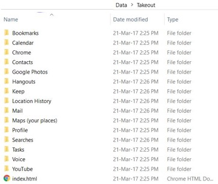

# Google_Search_Analyser

## Run the python notebook (using Jupyter Notebook(http://jupyter.org/install.html)) to see your own google search patterns by months, days and years. Type in your keyword to see what and when you searched for that keyword.

## Requirements:
  1) Download your personal google data: Follow the link here: https://support.google.com/accounts/answer/3024190?source=gsearch&hl=en
  
  2) Save the downloaded files in a folder named "Data"
  The path of the data files folder will look like -
  
  
  3) This notebook should be in the same folder as the "Data" folder

## Improvements to be done:

* Create a word cloud of the top searched words
* Visualize the trend in the keyword search (Time-series)
* Use the gmail data to find the top 10 senders and receivers
* Find the top 40 relevant keywords (excluding the in, on, the, symbols, etc) 

## If you have your own ideas please contribute. In case of any concerns, do let me know.  

##### I would like thank "Walker Harrison", some of the code snippets are taken from his repo. 
